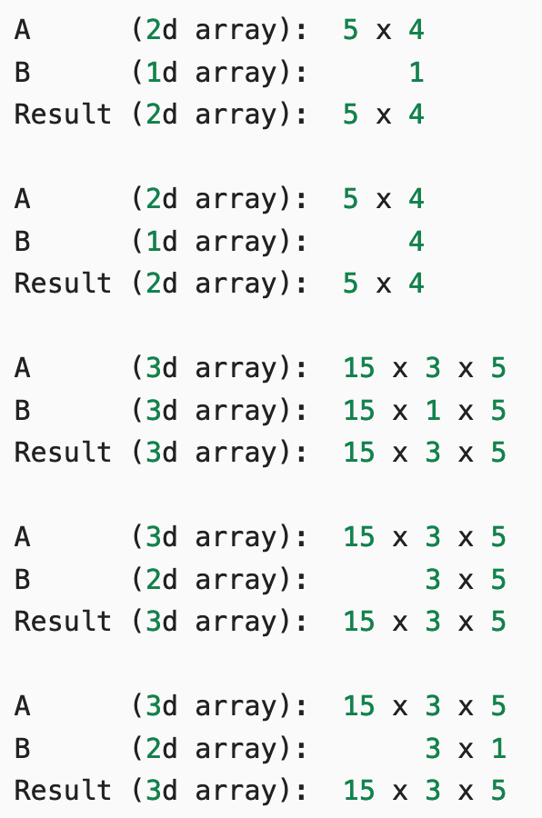
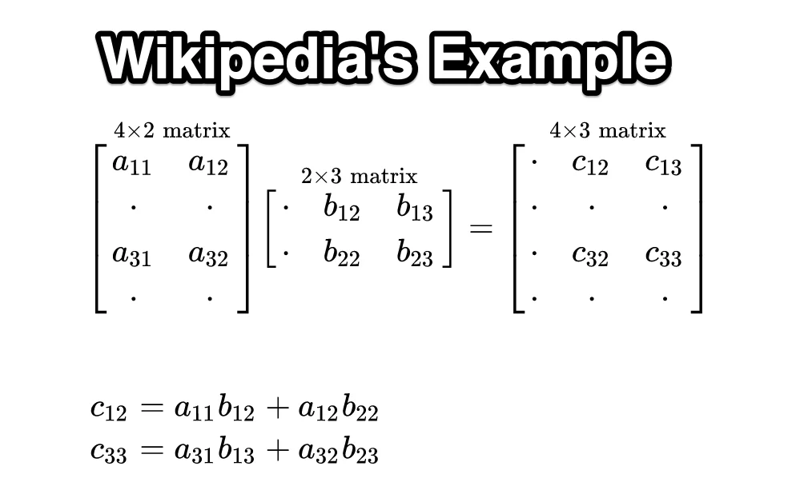

# 🐍 Computation with NumPy

## Imports

```python
import numpy as np
```

## ndarray

The crown jewel of NumPy is the `ndarray`.

> The ndarray is a homogeneous n-dimensional array object.

A Python List or a Pandas DataFrame can contain a mix of strings, numbers, or objects (i.e., a mix of different types).

**Homogenous** means **all the data have to have the same data type**, for example all floating-point numbers.

And n-dimensional means that **we can work with everything from a single column (1-dimensional) to the matrix (
2-dimensional) to a bunch of matrices stacked on top of each other (n-dimensional)**.

## 1-dimension arrays (Vectors)

```python
my_array = np.array([1.1, 9.2, 8.1, 4.7])

my_array.shape  # (4,)

my_array[2]  # np.float64(8.1)

my_array.ndim  # 1
```

## 2-dimensions arrays (Matrix)

```python
array_2d = np.array([[1, 2, 3, 9],
                     [5, 6, 7, 8]])
```

## 3 dimesions

```python
mystery_array = np.array([[[0, 1, 2, 3],
                           [4, 5, 6, 7]],

                          [[7, 86, 6, 98],
                           [5, 1, 0, 4]],

                          [[5, 36, 32, 48],
                           [97, 0, 27, 18]]])
```

Number of dimensions

```python
mystery_array.ndim  # 3
```

Shape

```python
mystery_array.shape  # (3, 2, 4) (z,x,y)
```

Access single value

```python
mystery_array[2, 1, 3]  # np.int64(18)
```

Access 1 dim array

```python
mystery_array[2, 1]  # array([97,  0, 27, 18])
```

Access 2 dim array

```python
mystery_array[:, :, 0]
```

```text
array([[ 0,  4],
       [ 7,  5],
       [ 5, 97]])
```

## Basic functions

[Documentation](https://numpy.org/devdocs/user/absolute_beginners.html)

### Range

```python
a = np.arange(10, 30)
print(a)  # [10 11 12 13 14 15 16 17 18 19 20 21 22 23 24 25 26 27 28 29]
```

### Slicing

```python
print(f'Last three elements: {a[-3:]}')  # Last three elements: [27 28 29]
print(f'4th, 5th and 6th: {a[3:6]}')  # [13 14 15]
print(f'All except the first 12: {a[12:]}')  # [22 23 24 25 26 27 28 29]
print(f'Only even numbers: {a[1::2]}')  # [11 13 15 17 19 21 23 25 27 29]
```

### Reverse

For 1 dim

```python
a_reverse = np.flip(a)
print(a_reverse)  # [29 28 27 26 25 24 ...
```

For 2 dims

```python
arr_2d = np.array([[1, 2, 3, 4], [5, 6, 7, 8], [9, 10, 11, 12]])

reversed_arr = np.flip(arr_2d)
print(reversed_arr)
```

```text
[[12 11 10  9]
 [ 8  7  6  5]
 [ 4  3  2  1]]
```

Reverse only rows

```python
reversed_arr_rows = np.flip(arr_2d, axis=0)
```

```text
[[ 9 10 11 12]
 [ 5  6  7  8]
 [ 1  2  3  4]]
```

Or the colums

```python
reversed_arr_columns = np.flip(arr_2d, axis=1)
```

```text
[[ 4  3  2  1]
 [ 8  7  6  5]
 [12 11 10  9]]
```

## Filtering

### Using `where`

```python
b = np.array([6, 0, 9, 0, 0, 5, 0])
indices = np.where(b != 0)[0]
values = b[indices]

print(indices)  # [2 3 4]
print(values)  # [30 40 50]
```

### Using `mask`

```python
mask = b != 0  # [ True False  True False False  True False]
indices = mask.nonzero()[0]
print(indices)  # [0 2 5]
```

## Random

https://numpy.org/doc/stable/reference/random/index.html#random-sampling

The [`numpy.random`](https://numpy.org/doc/stable/reference/random/index.html#module-numpy.random "numpy.random") module
implements pseudo-random number generators (PRNGs or RNGs, for short) with the ability to draw samples from a variety of
probability distributions. In general, users will create a [
`Generator`](https://numpy.org/doc/stable/reference/random/generator.html#numpy.random.Generator "numpy.random.Generator")
instance with [
`default_rng`](https://numpy.org/doc/stable/reference/random/generator.html#numpy.random.default_rng "numpy.random.default_rng")
and call the various methods on it to obtain samples from different distributions.

Create the random generator

```python
import numpy as np

rng = np.random.default_rng()
```

### `random()`

Generate one random float uniformly distributed over the range `[0,1)`:

```python
rng = np.random.default_rng()
random_3_3_3 = np.array([
    [rng.random(3), rng.random(3), rng.random(3)],
    [rng.random(3), rng.random(3), rng.random(3)],
    [rng.random(3), rng.random(3), rng.random(3)]
])

print(random_3_3_3.shape)  # (3, 3, 3)
print(random_3_3_3)
```

```text

[[[0.04396024 0.06264492 0.78843615]
  [0.05107559 0.15946561 0.69301774]
  [0.86429264 0.45796084 0.72954639]]

 [[0.2690629  0.32345278 0.51966162]
  [0.22668415 0.16629876 0.18982001]
  [0.30072503 0.86636061 0.22841145]]

 [[0.60101572 0.49763848 0.3849359 ]
  [0.89678841 0.45541928 0.43871133]
  [0.78224131 0.82192055 0.48590769]]]
```

### `standard_norma()`

Generate an array of 10 numbers according to a unit Gaussian distribution:

```python
rng.standard_normal(10)  
```

```text
array([-0.31018314, -1.8922078 , -0.3628523 , -0.63526532,  0.43181166,  # may vary
        0.51640373,  1.25693945,  0.07779185,  0.84090247, -2.13406828])
```

### `integers`

Generate an array of 5 integers uniformly over the range `[0,10)`:

```python
rng.integers(low=0, high=10, size=5)  # [7 6 1 1 5]
```

Generate a custom ndarray

```python
# values from [0:255) 128x128x3 (RGB matrix)
img = np.random.randint(0, 256, size=(128, 128, 3), dtype=np.uint8)
```

### Evenly distributed values

[`.linspace()`](https://numpy.org/doc/stable/reference/generated/numpy.linspace.html) creats a vector `x` of size 9 with
values spaced out evenly between 0 to 100 (both included).

```python
even = np.linspace(start=0, stop=100, num=9)
print(even)  #[  0.   12.5  25.   37.5  50.   62.5  75.   87.5 100. ]
```

```python
#%%
data = np.linspace(start=-3, stop=3, num=9)
print(data)
```

## Vector algebra

### Vectorial ops

Sum of all elements one by one

```python
v1 = np.array([4, 5, 2, 7])
v2 = np.array([2, 1, 3, 3])

v1 + v2  # array([ 6,  6,  5, 10])
v1 - v2  # array([ 2,  4, -1,  4])
v1 * v2  # array([ 8,  5,  6, 21])
v1 / v2  # array([2. , 5. , 0.66666667, 2.33333333])

```

> Vectorial operations does not apply to vectors of different sizes

### Scalar ops (Broadcast)

With vectors

```python
v1 = np.array([4, 5, 2, 7])

v1 + 2  # array([6, 7, 4, 9])
v1 - 2  # array([2, 3, 0, 5])
v1 * 2  # array([ 8, 10,  4, 14])
v1 / 2  # array([2. , 2.5, 1. , 3.5])
```

With matrix

```python
matrix = np.array([[1, 2, 3, 4],
                   [5, 6, 7, 8]])
matrix + 2
```

```text
array([[ 3,  4,  5,  6],
       [ 7,  8,  9, 10]])
```



```python
a = np.random.randint(0, 256, size=(15, 3, 5), dtype=np.uint8)
b = np.random.randint(0, 256, size=(15, 1, 5), dtype=np.uint8)

c = a * b
print(c.shape)  # (15, 3, 5)
```
NumPy compares shapes from right to left:

| Dimension | a  | b  | Result          |
|-----------|----|----|-----------------|
| last      | 5  | 5  | 5 ✅             |
| middle    | 3  | 1  | 3 ✅ (broadcast) |
| first     | 15 | 15 | 15 ✅            |

dimensions must be equal or
one of them must be 1 (then it gets broadcasted)

So:

b has shape (15, 1, 5)
the 1 in the middle gets stretched to 3

➡️ Final shape: (15, 3, 5)

The single value is calculated as such:

```text
c[i, j, k] = a[i, j, k] * b[i, 0, k]
```

🔑 Key insight:
* b only has 1 value along axis=1
* so that value is reused for all j = 0,1,2

### Matrix multiplication (`@` or `np.matmul`)

Row by column product



```python
a1 = np.array([[1, 3],
               [0, 1],
               [6, 2],
               [9, 7]])

b1 = np.array([[4, 1, 3],
               [5, 8, 5]])

c1 = np.matmul(a1, b1) #c1 = a1 @ b1

print(f'{a1.shape}: a has {a1.shape[0]} rows and {a1.shape[1]} columns.')
print(f'{b1.shape}: b has {b1.shape[0]} rows and {b1.shape[1]} columns.')
print('Dimensions of result: (4x2)*(2x3)=(4x3)')
print(c1)
```
Output
```text
(4, 2): a has 4 rows and 2 columns.
(2, 3): b has 2 rows and 3 columns.
Dimensions of result: (4x2)*(2x3)=(4x3)
[[19 25 18]
 [ 5  8  5]
 [34 22 28]
 [71 65 62]]
```

### Apply transformation to image via matric multiply

```python
from skimage import data
import numpy as np
import matplotlib.pyplot as plt

img = data.astronaut()# RGB image

print(type(img)) #<class 'numpy.ndarray'>
print(img.shape) #(512, 512, 3)
print(img[:,:,0].shape) #512,512

#Three components
red_img = np.zeros_like(img)
red_img[:, :, 0] = img[:, :, 0]  # keep only red channel
#plt.imshow(red_img)

green_img = np.zeros_like(img)
green_img[:, :, 1] = img[:, :, 1]  #keep only green channel
#plt.imshow(green_img)

blue_img = np.zeros_like(img)
blue_img[:, :, 2] = img[:, :, 2]  # keep only blue channel
```

```python
#scalar product
scalar_RGB_img = img/255

#gr = r_value*0.2126 + g_value*0.7152 + b_value*0.0722
gray_transf_array = np.array([0.2126, 0.7152, 0.0722])

#matrix product (512x512x3) @ (1,3) => 512x512
gray_img = scalar_RGB_img @ gray_transf_array
print(gray_img.shape) #(512, 512)

plt.imshow(gray_img, cmap='gray') #

plt.axis('off')
plt.show()
```