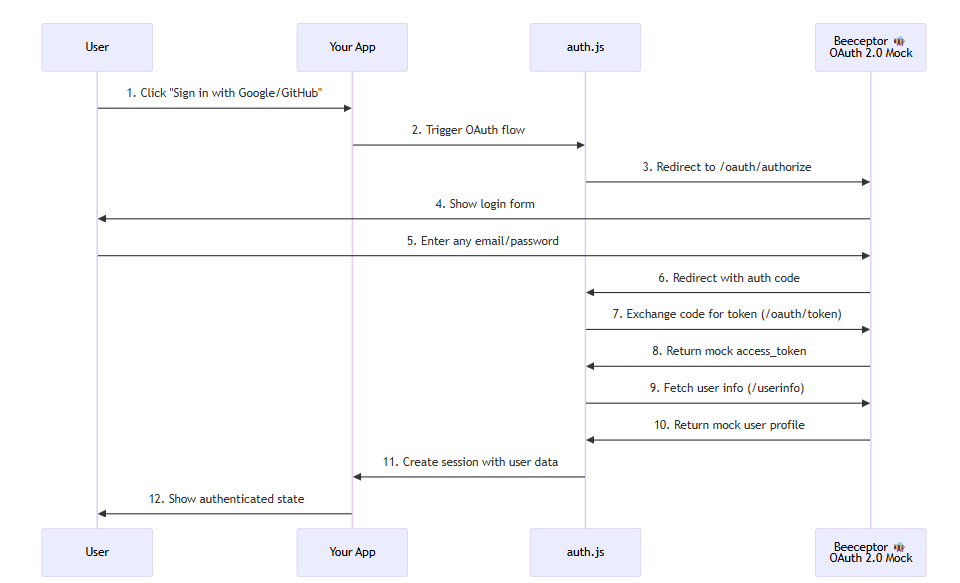

# 🐍 Authentication methods used in API calls

## Handle secret values

Never hardcode API keys. Use **environment variables**:

`Linux / macOS:`

```bash
export NASA_API_KEY="your_key"
```
`Windows (PowerShell)`:
```powershell
setx NASA_API_KEY "your_key"
```

## API KEY authentication

```python
import requests
import os

API_KEY = os.getenv("NASA_API_KEY")


url = "https://api.nasa.gov/planetary/apod"

params = {
    "api_key": API_KEY,
}


response = requests.get(url, params=params)

if response.status_code == 200:
    data = response.json()
    print(data)
else:
    print("Error:", response.status_code)
    print(response.text)
```

### Using basic authentication

We need the authorization header

`Authorization: Basic base64(username:password)`

### Using `auth` Parameter (Recommended)

```python
import requests

url = "https://httpbin.org/basic-auth/alex/1234"

response = requests.get(url, auth=("alex", "1234"))

print("Status:", response.status_code)
print("Response:", response.json()) 
```

Output 

```json
{
  "authenticated": true,
  "user": "alex"
}
```

if we try different password

```python
import requests

url = "https://httpbin.org/basic-auth/alex/1234"

response = requests.get(url, auth=("alex", "wrong_password"))

print("Status:", response.status_code)
print(response.status_code) #401
```

#### Create the authentication manually

Creates the header with base64 encoded authentication.

```python
import requests
import base64

username = "alex"
password = "1234"

credentials = f"{username}:{password}"
encoded_credentials = base64.b64encode(credentials.encode()).decode()

headers = {
    "Authorization": f"Basic {encoded_credentials}"
}

url = "https://httpbin.org/basic-auth/alex/1234"

response = requests.get(url, headers=headers)

print(response.status_code)
print(response.json())
```

### Bearer authentication

Bearer tokens are usually:

* JWT tokens

* OAuth2 access tokens

* Static API tokens

They are sent in the header like this:

`Authorization: Bearer YOUR_TOKEN_HERE`

```python
import requests

TOKEN = "mysecrettoken123"

url = "https://httpbin.org/bearer"

headers = {
    "Authorization": f"Bearer {TOKEN}"
}

response = requests.get(url, headers=headers)

print("Status:", response.status_code)
print("Response:", response.json())
```

Successful response

```json
{
  "authenticated": true,
  "token": "mysecrettoken123"
}
```

Without token the response code would be 401

### Differences between basic and bearer

| Basic Auth               | Bearer Token           |
| ------------------------ | ---------------------- |
| username + password      | token only             |
| Encoded base64           | Plain string           |
| Often static credentials | Usually short-lived    |
| Simpler                  | More secure + scalable |


## Full Oauth2 example Client Credentials flow

The flow is

1️⃣ Client → Authorization Server (request token)
2️⃣ Authorization Server → Client (returns access_token)
3️⃣ Client → API Server (uses Bearer token)

### Step1

We do a POST call to obtain the token in the response.
The call is usually to a OAuth server

The POST request has a payload with the JSON structure:

```json
{
    "grant_type": "client_credentials",
    "client_id": CLIENT_ID,
    "client_secret": CLIENT_SECRET,
}
```

The response contains

```json
{
  "access_token": "eyJhbGciOiJIUzI1NiIsInR5cCI6IkpXVCJ9...",
  "token_type": "Bearer",
  "expires_in": 3600
}
```

```python
import requests

TOKEN_URL = "https://example.com/oauth/token"  # Replace with real one
CLIENT_ID = "your_client_id"
CLIENT_SECRET = "your_client_secret"

def get_access_token():
    response = requests.post(
        TOKEN_URL,
        data={
            "grant_type": "client_credentials",
            "client_id": CLIENT_ID,
            "client_secret": CLIENT_SECRET,
        }
    )

    response.raise_for_status()
    token_data = response.json()

    return token_data["access_token"]
```

### Other OAuth2 Flows (For Context)

| Flow               | When Used                 |
| ------------------ | ------------------------- |
| Client Credentials | Backend → Backend         |
| Authorization Code | User login (Google login) |
| Device Code        | Smart TVs                 |
| Password Grant     | Legacy systems            |


### Authorization Code flow with Client credentials (Bearer token)

https://beeceptor.com/docs/tutorials/oauth-2-0-mock-usage/

In the diagram `auth.js` is actually the `flask` server



The mock server simulates Google OAuth2 flow with following info
```json
Google({
  clientId: "google-id-123", // IMPORTANT, use this value for the mock setup!
  clientSecret: "dummy-google-secret",
  authorization: {
    url: "https://oauth-mock.mock.beeceptor.com/oauth/authorize",
  },
  token: {
    url: "https://oauth-mock.mock.beeceptor.com/oauth/token/google",
  },
  userinfo: {
    url: "https://oauth-mock.mock.beeceptor.com/userinfo/google",
  },
  profile(profile) {
    return {
      id: String(profile.sub),
      name: profile.name,
      email: profile.email,
      image: profile.picture,
    }
  },
})
```

The flask server simulate an OAuth2 client willing to connect to the mock server, using Google profile

```python
from flask import Flask, request
import requests
import webbrowser
from threading import Thread

app = Flask(__name__)

# ===== CONFIGURATION =====
CLIENT_ID = "YOUR_CLIENT_ID"
CLIENT_SECRET = "YOUR_CLIENT_SECRET"
AUTHORIZATION_URL = "https://example.com/oauth/authorize"
TOKEN_URL = "https://example.com/oauth/token"
REDIRECT_URI = "http://127.0.0.1:5000/callback"
SCOPE = "read"  # depends on API

access_token = None

# ===== ROUTES =====
@app.route("/")
def index():
    # Step 1: Redirect user to OAuth provider
    return f'<a href="{AUTHORIZATION_URL}?response_type=code&client_id={CLIENT_ID}&redirect_uri={REDIRECT_URI}&scope={SCOPE}">Login with OAuth2</a>'

@app.route("/callback")
def callback():
    global access_token
    # Step 2: Get authorization code
    code = request.args.get("code")
    if not code:
        return "No code found", 400

    # Step 3: Exchange code for access token
    data = {
        "grant_type": "authorization_code",
        "code": code,
        "redirect_uri": REDIRECT_URI,
        "client_id": CLIENT_ID,
        "client_secret": CLIENT_SECRET
    }

    response = requests.post(TOKEN_URL, data=data)
    response.raise_for_status()
    token_data = response.json()
    access_token = token_data.get("access_token")

    return f"Access token received: {access_token[:10]}..."  # hide most of token

def open_browser():
    webbrowser.open("http://127.0.0.1:5000/")

if __name__ == "__main__":
    # Open browser in a separate thread
    Thread(target=open_browser).start()
    app.run(port=5000)

```

Clicking on the link sho