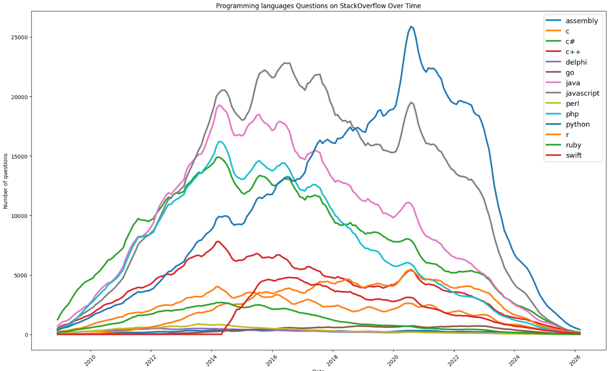
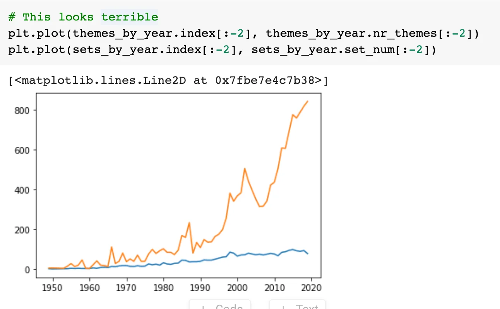
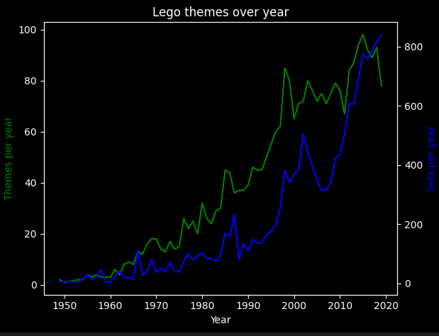
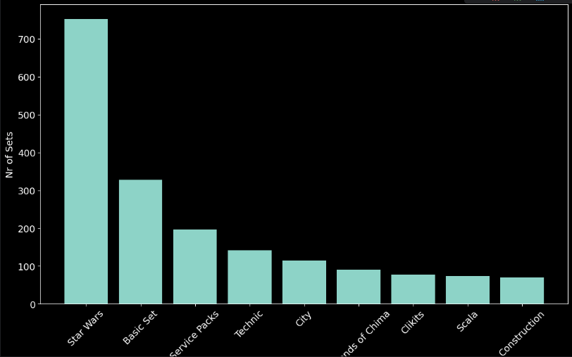

# 🐍 Plot data with Matplotlib

Matplotlib is an incredibly popular one and it works beautifully in combination with Pandas, so let's check it out. 

https://matplotlib.org/3.2.1/api/_as_gen/matplotlib.pyplot.plot.html#matplotlib.pyplot.plot

```python

import pandas as pd

df = pd.read_csv("csv_file.csv");
print(df.head())
```
Output
```
        Date   TagName  NumTags
0 2008-07-01        c#        3
1 2008-08-01  assembly        8
2 2008-08-01         c       82
3 2008-08-01        c#      503
4 2008-08-01       c++      164
```

Now we can print the 2D plot

```python
import matplotlib.pyplot as plt
# plot('xlabel', 'ylabel', data=obj) 
plt.plot('Date', 'NumTags', data=df)
```


We can also plot a series on a pivot data frame 

```python
print(df_pivot.java.head())
Date
2008-07-01       0.0
2008-08-01     220.0
2008-09-01    1121.0
2008-10-01    1142.0
2008-11-01     951.0
Name: java, dtype: float64
```
this represent the values for the `java` column over time

Make sure the index is a `dt` date time data

```python
df_pivot.java.index = pd.to_datetime(df_pivot.java.index)
```

```python
plt.figure()

# Plots
plt.plot(df_pivot.java.index, df_pivot.java.values, color='c', linestyle='--', label='JAVA-lbl')
plt.plot(df_pivot.c.index, df_pivot.c.values, color='b', linestyle='-', label='C-lbl')

# Labels
plt.xlabel("Date")
plt.ylabel("Number of questions")
plt.title("Java and C Questions on StackOverflow Over Time")


# Legend
plt.legend()

# Improve date display
plt.xticks(rotation=45)

# Show
plt.tight_layout()
plt.show()
```


## Methods

* `.figure()` - allows us to resize our chart
* `.xticks()` - configures our x-axis
* `.yticks()` - configures our y-axis
* `.xlabel()` - add text to the x-axis
* `.ylabel()` - add text to the y-axis
* `.ylim()` - allows us to set a lower and upper bound

## Smooth the curves with rolling mean

Looking at our chart we see that time-series data can be quite noisy, with a lot of up and down spikes. This can sometimes make it difficult to see what's going on.

A useful technique to make a trend apparent is to smooth out the observations by taking an average. By averaging say, 6 or 12 observations we can construct something called the rolling mean. Essentially we calculate the average in a window of time and move it forward by one observation at a time.

Since this is such a common technique, Pandas actually two handy methods already built-in: `[rolling()](https://pandas.pydata.org/pandas-docs/stable/reference/api/pandas.DataFrame.rolling.html)` (to create the rolling window of the given size for the next operation)
and `[mean()](https://pandas.pydata.org/pandas-docs/stable/reference/api/pandas.core.window.rolling.Rolling.mean.html)`. 
We can chain these two methods up to create a `DataFrame` made up of the averaged observations.


```python
# The window is number of observations that are averaged
roll_df = reshaped_df.rolling(window=6).mean()
```

## Print all columns of a DataFrame in the same figure

```python

mean_df = df_pivot.rolling(window=6).mean()

plt.figure(figsize=(16,10))

# Plots
for column in mean_df.columns:
  plt.plot(mean_df.index, mean_df[column].values, label=mean_df[column].name, linewidth=3) 

# Labels
plt.xlabel("Date")
plt.ylabel("Number of questions")
plt.title("Programming languages Questions on StackOverflow Over Time")


# Legend
plt.legend(fontsize=13)

# Improve date display
plt.xticks(rotation=45)

# Show
plt.tight_layout()
plt.show()
```



## Compose multi axes plots

If we want to plot two series where the x-axis have two different scales in one figure 
we have to normalize the view

If we reuse the same axis we would have 


The problem is that the "number of themes" and the "number of sets" have very different scales. 
The theme number ranges between 0 and 90, while the number of sets ranges between 0 and 900.

```python
df_themes_per_year = df_sets.groupby("year").agg({"theme_id": pd.Series.nunique})[:-2:]
df_sets_per_year = df_sets.groupby("year").agg({"set_num": pd.Series.nunique})[:-2:]
print(df_themes_per_year.head())


import matplotlib.pyplot as plt
plt.figure()

#Extract the axes
ax1 = plt.gca() # get current axes
ax2 = ax1.twinx() # create another axis sharing the same x1 axes

# Plots
ax1.plot(df_themes_per_year.index, df_themes_per_year.theme_id.values, color="green")

ax2.plot(df_sets_per_year.index, df_sets_per_year.set_num.values, color="blue")

# Labels
ax1.set_xlabel("Year")
ax1.set_ylabel("Themes per year", color="green")
ax2.set_ylabel("Sets per year", color="blue")
plt.title("Lego themes over year")


# Improve date display
plt.xticks(rotation=45)

# Show
plt.tight_layout()
plt.show()


```



## Draw a numpy array

```python
import numpy as np
import matplotlib as plt
data = np.linspace(start=-3, stop=3, num=9)
print(data) #[-3.   -2.25 -1.5  -0.75  0.    0.75  1.5   2.25  3.  ]

plt.figure()

# Plots
plt.plot(data, color='c', linestyle='--', label='JAVA-lbl')

# Labels
plt.xlabel("Index")
plt.ylabel("Value")
plt.title("Draw a NumPy 1 dim array")


# Show
plt.show()


```

## Draw bar chart

```python
print(merged_df.head())
```

```
    id  set_count           name  parent_id
0  158        753      Star Wars        NaN
1  505        328      Basic Set      504.0
2  443        197  Service Packs        NaN
3  453        142        Technic      443.0
4   52        115           City       50.0
```

```python
import matplotlib.pyplot as plt
plt.figure()
plt.figure(figsize=(14,8))
#rotates the x names 
plt.xticks(fontsize=14, rotation=45)
plt.yticks(fontsize=14)
plt.ylabel('Nr of Sets', fontsize=14)
plt.xlabel('Theme Name', fontsize=14)
plt.bar(merged_df.name[:10], merged_df.set_count[:10]) 
```



## Show a 3-dim numpy ndarray as image with `imshow()`

```python
import numpy as np
import matplotlib.pyplot as plt

random_img = np.random.randint(0, 256, size=(128, 128, 3), dtype=np.uint8)

# Display image
plt.imshow(random_img)
plt.axis('off')  # hide axes
plt.title("Random RGB Image")
plt.show()
```

```python
from skimage import data
import numpy as np
import matplotlib.pyplot as plt

img = data.astronaut()# RGB image

print(type(img)) #<class 'numpy.ndarray'>
print(img.shape) #(512, 512, 3)
plt.imshow(img)
plt.axis('off')
plt.show()
```