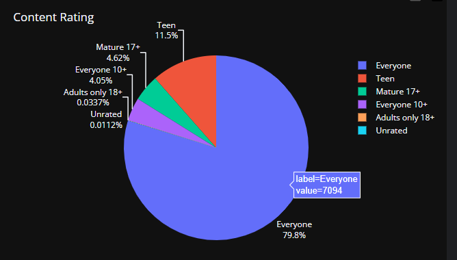
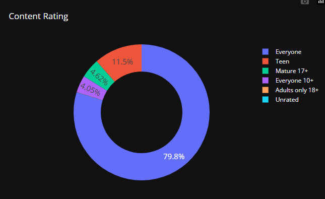
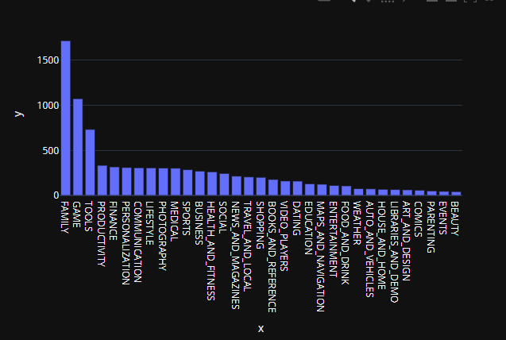
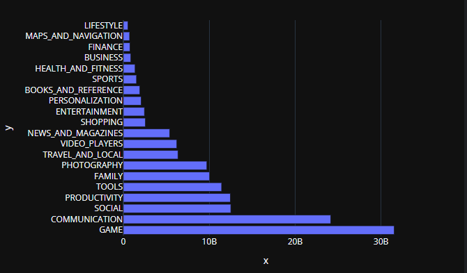
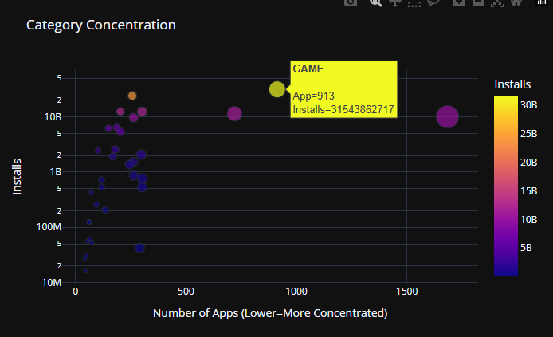
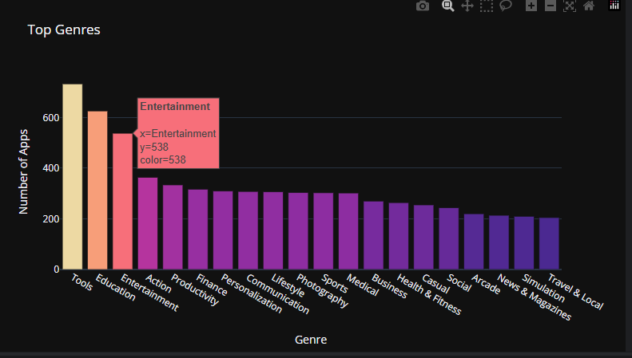

# 🐍 Plot data with Plotly 

[Website](https://plotly.com/python/)

given the pandas dataFrame

## Draw pie diagram

```python
ratings.head 
```

```text
Content_Rating
Everyone           7094
Teen               1022
Mature 17+          411
Everyone 10+        360
Adults only 18+       3
Name: count, dtype: int64
```

We draw the diagram

```python
fig = px.pie(labels=ratings.index,
values=ratings.values,
title="Content Rating",
names=ratings.index,
)
fig.update_traces(textposition='outside', textinfo='percent+label')
fig.show()
```



## Draw the donut diagram

We just add a `hole` to the pie diagram

```python
import plotly.express as px

fig = px.pie(labels=ratings.index,
values=ratings.values,
title="Content Rating",
names=ratings.index, #takes the index values as names of the categories
hole=0.6,
)
fig.update_traces(textposition='inside', textfont_size=15, textinfo='percent')
```



## Draw bar diagram

```python
df_apps_per_cat = df_apps_clean.Category.value_counts()
bar = px.bar(x = df_apps_per_cat.index, # index = category name
             y = df_apps_per_cat.values)

bar.show()
```


We want to add the total number of installations per category using `agg` 

```python
df_installs_per_cat = df_apps_clean.groupby('Category').agg({'Installs': 'sum'}).sort_values("Installs", ascending=False).head(20)
h_bar = px.bar(x = df_installs_per_cat.Installs,
               y = df_installs_per_cat.index,
               orientation='h')
 
h_bar.show()
```



## Scatter plot

Indicates a bi-dimensional graph where a single value 
has a (x,y) coordinate couple for two different measurements

Create the data frame that, per Category countes the number of apps and the total number of installations:

```python
df_installs_per_cat = df_apps_clean[['Category','Installs', 'App']]
    .groupby('Category')
    .agg({'Installs': 'sum', 'App': pd.Series.nunique})
    .sort_values("Installs", ascending=False)
df_installs_per_cat.head()
```

```text
                  Installs  App
Category                       
GAME           31543862717  913
COMMUNICATION  24152241530  257
SOCIAL         12513841475  203
PRODUCTIVITY   12463070180  301
TOOLS          11440724500  720
```

```python
scatter = px.scatter(df_installs_per_cat, # data
                    x='App', # column name
                    y='Installs',
                    title='Category Concentration',
                    size='App',
                    hover_name=df_installs_per_cat.index,
                    color='Installs')

scatter.update_layout(xaxis_title="Number of Apps (Lower=More Concentrated)",
                      yaxis_title="Installs",
                      yaxis=dict(type='log'))

scatter.show()
```



## Colored bar graph
Given
```python
num_genres.head()
```
```text
Tools            733
Education        626
Entertainment    538
Action           364
Productivity     334
Name: count, dtype: int64
```
We can draw the bar diagram
```python
bar = px.bar(x = num_genres[:20].index, # index = category name
             y = num_genres[:20].values, #count
             title='Top Genres',
             hover_name= num_genres[:20].index,
             color= num_genres[:20].values,
             color_continuous_scale='Agsunset')

bar.update_layout(xaxis_title='Genre',
yaxis_title='Number of Apps',
coloraxis_showscale=False)

bar.show()
```



