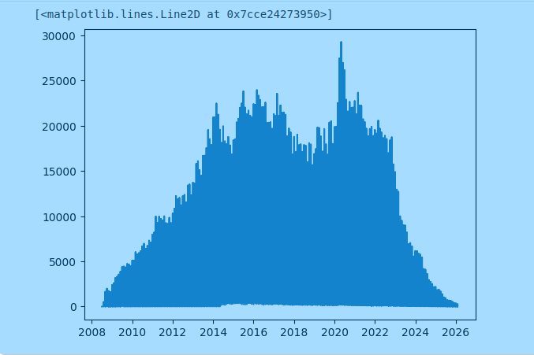
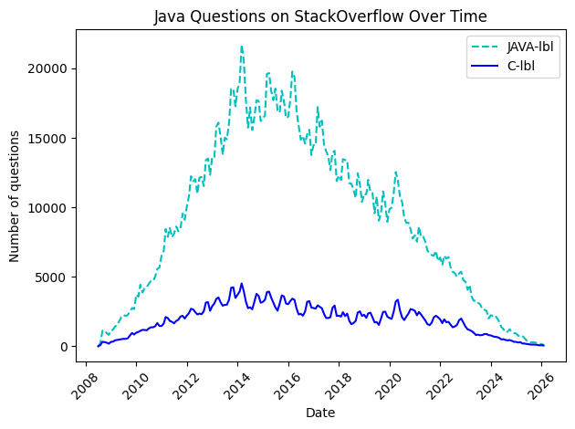

# 🐍 Plot data with Matplotlib

Matplotlib is an incredibly popular one and it works beautifully in combination with Pandas, so let's check it out. 

## Plot a Pandas DataFrame with `pyplot`

https://matplotlib.org/3.2.1/api/_as_gen/matplotlib.pyplot.plot.html#matplotlib.pyplot.plot

```python

import pandas as pd

df = pd.read_csv("csv_file.csv");
print(df.head())
```
Output
```
        Date   TagName  NumTags
0 2008-07-01        c#        3
1 2008-08-01  assembly        8
2 2008-08-01         c       82
3 2008-08-01        c#      503
4 2008-08-01       c++      164
```

Now we can print the 2D plot

```python
import matplotlib.pyplot as plt
# plot('xlabel', 'ylabel', data=obj) 
plt.plot('Date', 'NumTags', data=df)
```



We can also plot a series on a pivot data frame 

```python
print(df_pivot.java.head())
Date
2008-07-01       0.0
2008-08-01     220.0
2008-09-01    1121.0
2008-10-01    1142.0
2008-11-01     951.0
Name: java, dtype: float64
```
this represent the values for the `java` column over time

Make sure the index is a `dt` date time data

```python
df_pivot.java.index = pd.to_datetime(df_pivot.java.index)
```

```python
plt.figure()

# Plots
plt.plot(df_pivot.java.index, df_pivot.java.values, color='c', linestyle='--', label='JAVA-lbl')
plt.plot(df_pivot.c.index, df_pivot.c.values, color='b', linestyle='-', label='C-lbl')

# Labels
plt.xlabel("Date")
plt.ylabel("Number of questions")
plt.title("Java and C Questions on StackOverflow Over Time")


# Legend
plt.legend()

# Improve date display
plt.xticks(rotation=45)

# Show
plt.tight_layout()
plt.show()
```




### Methods

* `.figure()` - allows us to resize our chart
* `.xticks()` - configures our x-axis
* `.yticks()` - configures our y-axis
* `.xlabel()` - add text to the x-axis
* `.ylabel()` - add text to the y-axis
* `.ylim()` - allows us to set a lower and upper bound

### Smooth the curves with rolling mean

Looking at our chart we see that time-series data can be quite noisy, with a lot of up and down spikes. This can sometimes make it difficult to see what's going on.

A useful technique to make a trend apparent is to smooth out the observations by taking an average. By averaging say, 6 or 12 observations we can construct something called the rolling mean. Essentially we calculate the average in a window of time and move it forward by one observation at a time.

Since this is such a common technique, Pandas actually two handy methods already built-in: `[rolling()](https://pandas.pydata.org/pandas-docs/stable/reference/api/pandas.DataFrame.rolling.html)` (to create the rolling window of the given size for the next operation)
and `[mean()](https://pandas.pydata.org/pandas-docs/stable/reference/api/pandas.core.window.rolling.Rolling.mean.html)`. 
We can chain these two methods up to create a `DataFrame` made up of the averaged observations.


```python
# The window is number of observations that are averaged
roll_df = reshaped_df.rolling(window=6).mean()
```

### Print all columns of a DataFrame in the same figure

```python

mean_df = df_pivot.rolling(window=6).mean()

plt.figure(figsize=(16,10))

# Plots
for column in mean_df.columns:
  plt.plot(mean_df.index, mean_df[column].values, label=mean_df[column].name, linewidth=3) 

# Labels
plt.xlabel("Date")
plt.ylabel("Number of questions")
plt.title("Programming languages Questions on StackOverflow Over Time")


# Legend
plt.legend(fontsize=13)

# Improve date display
plt.xticks(rotation=45)

# Show
plt.tight_layout()
plt.show()
```